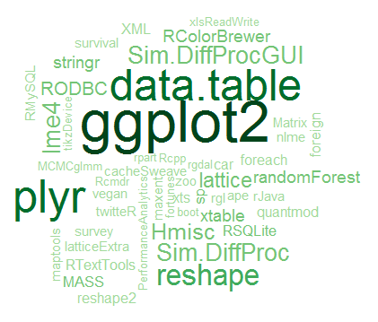
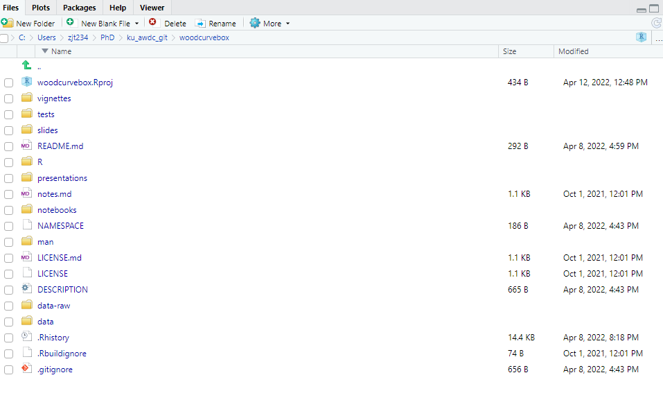
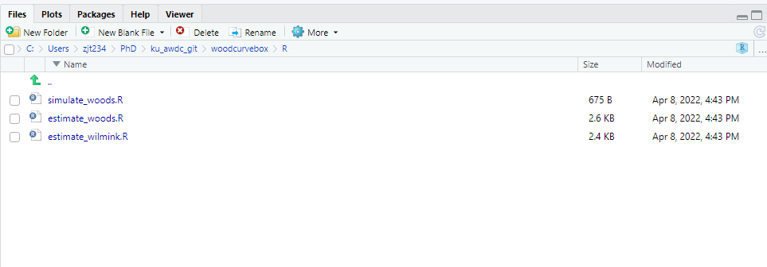
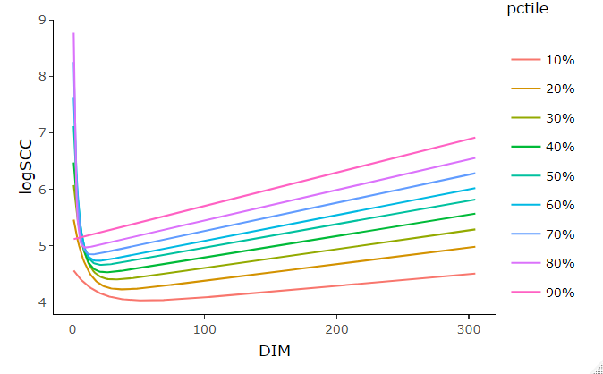

```{r setup, include=FALSE}
knitr::opts_chunk$set(echo = TRUE)
```

# Introduction to R-packages


```{r, echo=FALSE}
#
knitr::include_graphics("graphics/packages4.png")
```

---
# Let's start with the whys

- Order in script-chaos


---
# Let's start with the whys

- Order in script-chaos

- Create reproducible research


---
# Let's start with the whys

- Order in script-chaos

- Create reproducible research

- Facilitates collaborations with others


---
# Let's start with the whys


- Order in script-chaos

- Create reproducible research

- Facilitates collaborations with others

- Extend the basic R


---
# Let's start with the whys

- Order in script-chaos

- Create reproducible research

- Facilitates collaborations with others

- Extend the basic R

- Matt & Mossa said it was a good idea


---

# What does it entails?

You have to...

- Adhere to a very specific file structure

- Tolerate start-up friction


And then you can enjoy the benefits of having all your favorite functions collected; ready to use and to share


---

# To sum it up

If you want to reuse code later or want others to be able to use your code, you should put it in a package


---

# Get started

Create a directory, and name it what you would name the package


---

# Get started

Create a directory, and name it what you would name the package

in `notebooks/` :
- *scripts*


---

# Get started

Create a directory, and name it what you would name the package

in `notebooks/` :
- *scripts*

in `R/` : 
- Create functions
- Simulate data


---

# Get started

Create a directory, and name it what you would name the package

in `notebooks/` :
- *scripts*

in `R/` : 
- Create functions
- Simulate data


in `man/` :
- documentation files


---

# Get started

Create a directory, and name it what you would name the package

in `notebooks/` :
- *scripts*

in `R/` : 
- Create functions
- Simulate data


in `man/` :
- documentation files


The `NAMEPACE` is for export and imports packages

And the `DESCRIPTION` is for basic descriptions


---

# Get started

Create a directory, and name it what you would name the package

in `notebooks/` :
- *scripts*

in `R/` : 
- Create functions
- Simulate data


in `man/` :
- documentation files


The `NAMEPACE` is for export and imports packages

And the `DESCRIPTION` is for basic descriptions


Create the `Vignette` for the end


---

# Guided tour

Files in our upcoming `woodcurvebox` package

```{r, echo=FALSE}

```


---

# Guided tour

My functions

```{r, echo=FALSE}

```

---
# My timeline

R package is not for me...
Learning tidy..
...

---

# My Goal..

.. is for everyone to see the beauty in Somatic Cell Count Curves

```{r, echo=FALSE}

```
